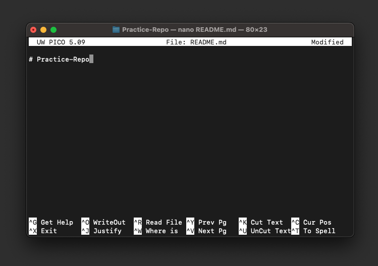
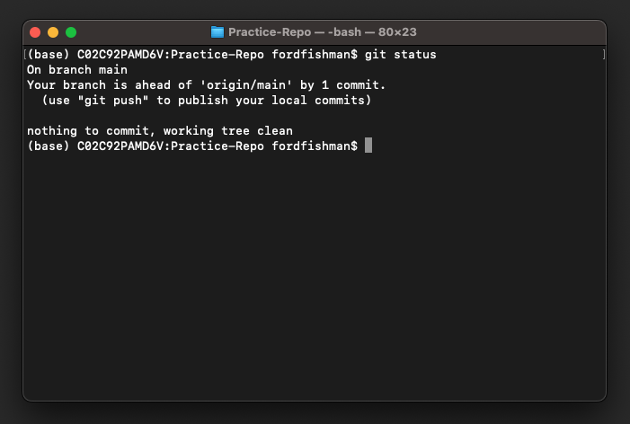

# Session 1: Getting started!
In this workshop, we are using **git** and [GitHub.com](https://github.com/).

**Git** is a version control system that lets you track who made changes to what when and has options for easily updating a version of your work. 

**GitHub.com** You will need a free account for part of this workshop. We will follow the instruction to keep your email address private at GitHub.

**Git Vocabulary**
- Commit: (noun) A recorded version of your project. (verb) To record a new version of your project.
- Repository (or repo): where your files are stored, can be on your computer (local) or on GitHub's servers (remote)
  
Definitions adapted from [git-scm.com](https://git-scm.com/docs/gitglossary)

<br>

## Register for a GitHub Account
Go to [GitHub.com](https://github.com), register for an account, and verify it. 

<br>

## Installation Instructions
<br>


### Windows

You will installing [Git Bash](https://gitforwindows.org/) (also called Git for Windows). Detailed instructions can be found via [Software Carpentries](https://carpentries.github.io/workshop-template/#shell).

### MacOS

Open Terminal. It should be located in `Applications/Utilities`. You use Spotlight to locate it as well (<kbd>cmd</kbd>+<kbd>spacebar</kbd> and type "Terminal").

Type `which git` and press Return. If it prints a path (e.g. `/usr/bin/git`), Git is already installed. 

If no path is printed, follow the instructions at [the Software Carpentries](https://carpentries.github.io/workshop-template/#git) for MacOS.

### Linux

Open the terminal. Type `which git` and press Return. If it prints a path (e.g. `/usr/bin/git`), git is already installed. If not, for Debian/Ubuntu run `sudo apt-get install git` and for Fedora run `sudo dnf install git`.

<br>

### Configure git global settings
When we use Git on a new computer for the first time, we need to configure a few things. Below are a few examples of configurations we will set as we get started with Git:
- our name and email address,
- what our preferred text editor is,
- and that we want to use these settings globally (i.e. for every project).

**Windows**:  Open the git shell "Git Bash" you downloaded through the bash installation procedures, or run the command "bash" in your Command Prompt.

**MacOS**:  Open a bash shell in Terminal.

**Linux**:  Use your terminal.

In the bash shell, run the following commands (with your information). The leading `$` indicates that the command should be run in `bash`. Do not insert an additional `$` in your own terminal. If the commands are successful, nothing will print to the terminal.

To use `git` commands, we use the syntax `git SOME_COMMAND`. We will be using `git config` with some added parameters to set up `git`.

**Name configuration**

```bash
$ git config --global user.name "InigoMontoya"
```

**Email configuration**
- Log in to [GitHub.com](https://github.com)
- Click on your profile icon at the top right corner
- Go to Settings
- Click on Emails in the left menu
- Select the check box "Keep my email addresses private" and use the private github.com-supplied email listed in the cnnfiguration below.  You can highlight and copy it with <kbd>Ctrl</kbd>+<kbd>C</kbd> or <kbd>cmd</kbd>+<kbd>C</kbd> (Mac), and paste to the command line with <kbd>Ctrl</kbd>+<kbd>V</kbd> or <kbd>cmd</kbd>+<kbd>V</kbd>.
 
```bash
$ git config --global user.email "1234username@users.noreply.github.com"
```

**Line Heading configuration**

As with other keys, when you hit Return on your keyboard, your computer encodes this input as a character. Different operating systems use different character(s) to represent the end of a line. Because Git uses these characters to compare files, it may cause unexpected issues when editing a file on different machines. 

*Windows*
```bash 
$ git config --global core.autocrlf true
```

*MacOS and Linux* 
```bash 
$ git config --global core.autocrlf input
```

**Editor configuration**

In these sessions, we will be using a basic editor called nano.  There are other ways to configure for more popular editors [here](http://swcarpentry.github.io/git-novice/02-setup/index.html).
```bash
$ git config --global core.editor "nano -w"
```

Check your settings at any time with:  
```bash
$ git config --list
```
<br>

## Create a remote repository on GitHub

Go to GitHub and create a new repository by clicking "New". 

<br>


<br>

Give your repo a short but descriptive name with no spaces or special characters. Note that your account cannot have two repos with exactly the same name. 

<br>


<br>

You can choose whether or not your repository to be private. If you plan to collaborate with others, you are required to have a public repository unless you pay for a premium GitHub account.

Make sure to initialize with a README, which will give general information about your repository. You can also initialize with a license, which defines what others can and cannot do with your code. 

<br>

## Clone the remote repository to your machine

To get this repository we have initialized onto our local machine we will clone it, which copies its contents. Go to the repository you just made on GitHub. You will see a README.md file and a license file. Click on "Code", which opens a dropdown menu. Copy the HTTPS link, which will be `https://github.com/{USERNAME}/{REPO-NAME}.git`, with your username and repo name, respectively.

<br>


<br>

Go back to your terminal. Create a new `GitHub` folder in your home directory by running:

```bash
$ mkdir ~/GitHub
```

This uses the Unix command `mkdir` (Make Directory) to create a new folder. We then want to go to that folder with the `cd` (Change Directory) command.

```bash
$ cd ~/GitHub
```

To clone your repository, run the following:

```bash
$ git clone https://github.com/{USERNAME}/{REPO-NAME}.git
```

Move to your newly cloned local repository and list the files with `ls` command.

```bash
$ cd {REPO-NAME}
$ ls
```

You should see the names of the files `LICENSE` and `README.md` printed to the terminal. 

## Alter the README 

You now have a local **downstream** repository on your machine. The remote GitHub repository is referred to as the **upstream** repository. If other users make changes reflected in the upstream repository, you will receive and implement them locally.

We are going to write line to the README and commit that change to version control. In later sessions, we will push that change upstream to make it reflected in GitHub.

First, we are going to use a text editor called `nano` to open `README.md`.

```bash
$ nano README.md
```

<br>



<br>

Tap the <kbd>&#8595;</kbd> key to get to a new line. Type whatever your heart desires ("Hello World!" is a classic). To save or "write" your changes, press <kbd>Ctrl</kbd>+<kbd>O</kbd>, and then hit <kbd>Return</kbd>. Press <kbd>Ctrl</kbd>+<kbd>X</kbd> to exit `nano`.

<br>


<br>

Now that you've made a change, you can check the status of the repository.

```bash
$ git status
```


This command prints out a lot of information. It says we are on the main branch (more on this in the future). It says we are up to date with `origin/main`. This means thats GitHub doesn't have any commits that aren't present locally and vice versa. It then lists `README.md` in red as modified but not yet staged, as well the commands for how to stage it. Finally, it says that nothing has yet been added to commit yet.  

We want to stage our modified file. Staging a file means we want to commit it. To do this, we'll use the `git stage` command.

```bash
$ git stage README.md
```

If we run `git status` again, we'll see that `README.md` is now staged for commit and in green text.


Now we are ready to commit these changes. We are going to use `git commit` with a message flag (`-m`). The message we write should give a short description of changes you added in this commit.

```bash
$ git commit -m "Updated the README"
```

The terminal will print out some information about your commit including how many files were changed and how many lines were inserted and deleted.

If we run `git status` again, we'll notice a few things. 




It now tells us that we no longer have any changes to commit in our local repository. It also is telling us that we are ahead of the upstream repository on GitHub by 1 commit. This is because our changes have not yet been sent or "pushed" to that remote repository yet. We will do this next session. 


## Recap: Important Git commands
- `git status`: shows what is in staging and was is being commited.
- `git add file_name`: Moves a file to staging.
- `git commit -m "Detailed log message goes here."`: Commits files in staging to history and documents message to the log.

## Resources